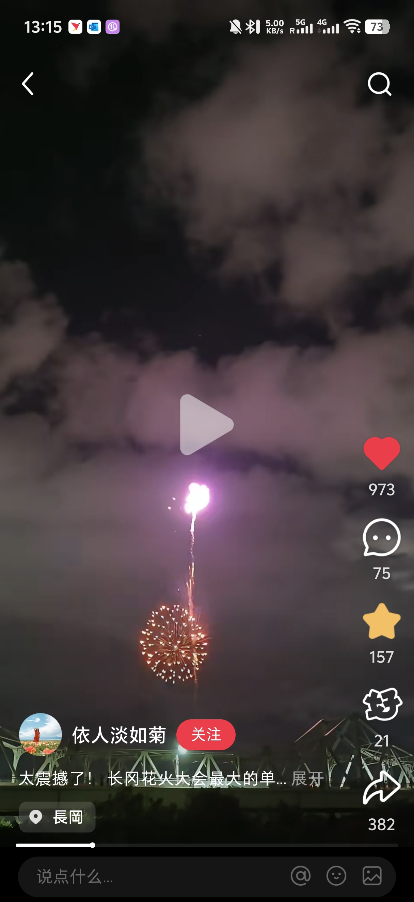
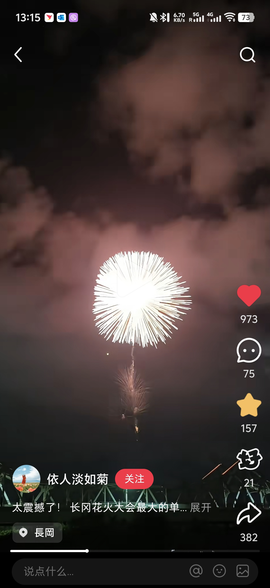
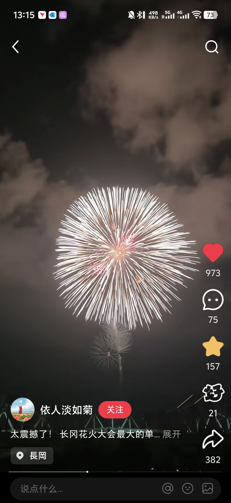
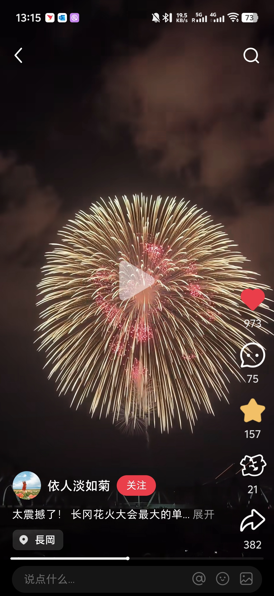
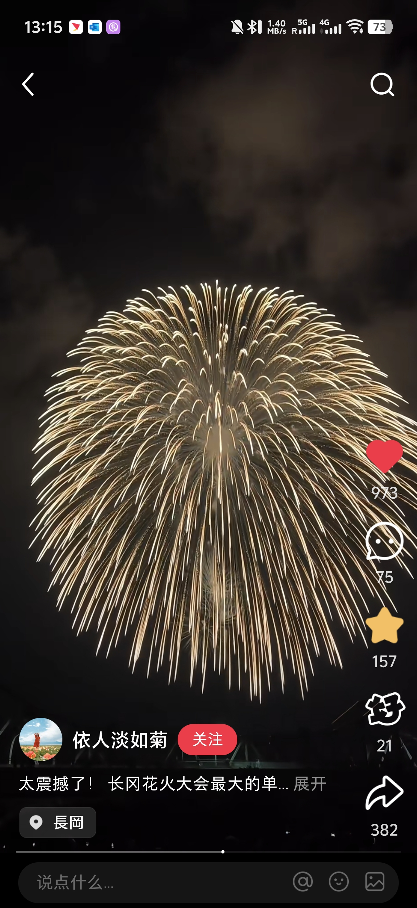
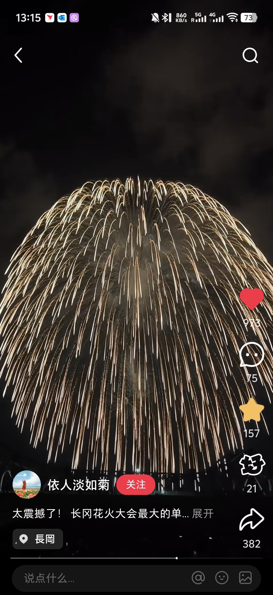
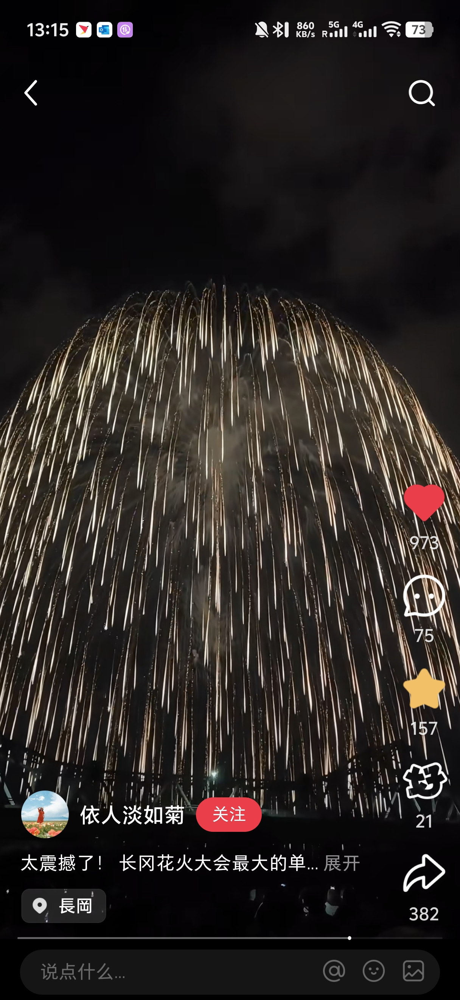
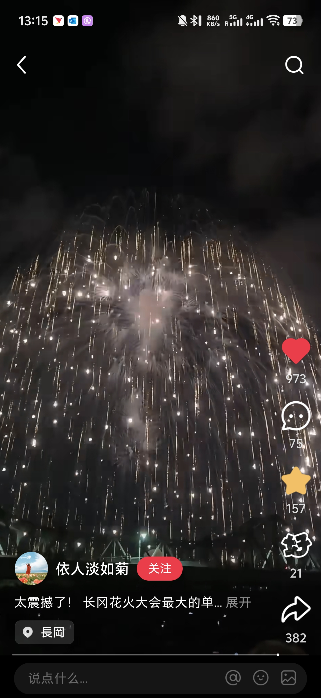
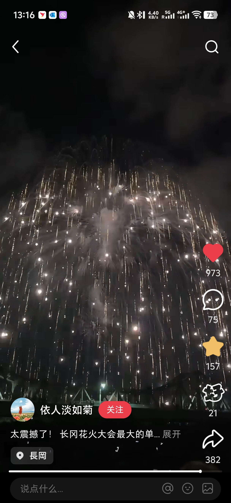

# 正三尺玉

时间顺序

使用p5.js画出
1. 鼠标点击，较粗烟花轨迹从底部出现，蛇形向上，紫金色，尾迹为渐变金色逐渐稀疏并消失的消失的圆点，约3S
2. 到鼠标点击位置炸裂，快速高亮度白偏金色，轨迹近似直线但是有各向异性，较密集，约150条，炸裂持续5S。
   1. 完全裂开后重力效果显现，整体每条像长水滴型，伴随红金色微小红点持续成团出现在金色轨迹之间，约2S。
   2. 炸裂之后2S，白金色逐渐褪色为金色，红金色褪色为红色，红色点受重力影响也下落，红点消失很快。约3S完全消失。
3. 红点完全消失，金色轨迹继续受重力影响下落并变细变稀疏，并逐步渐变为淡亮度白色，从出现到消失时间约15S
4. 每条白金色轨迹近似消失，轨迹密度很低时，在头部概率出现高亮度白点闪烁，持续3S。在第一次鼠标点击的后3000帧记录并保存。